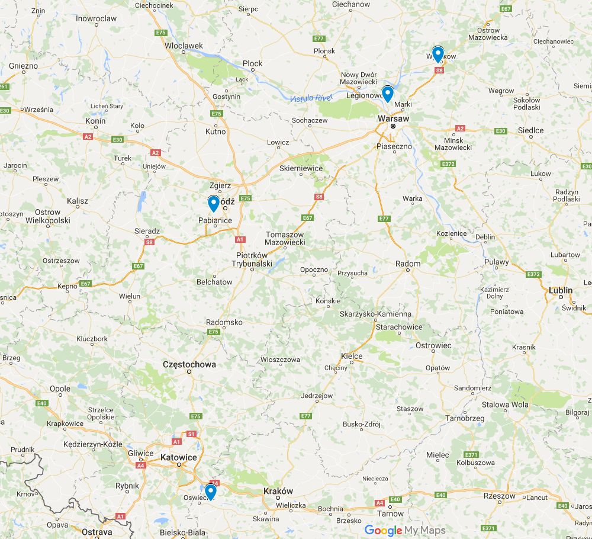

# Sequences from Poland

These sequences were provided by Lukasz Dziewit and Przemek Decewicz from [Uniwersytet Warszawski](http://www.uw.edu.pl/). They sampled four locations from around Poland on two different dates, 01/26/2016 and 03/03/2016. 

[](https://drive.google.com/open?id=1iPazu6smwlTutk75UbrUBvlNb2Q&usp=sharing)

They sampled four different wastewater plants: two are typical municipal plants:

- Municipal Group Wastewater Treatment Plant "Czajka", Czajki 4/6, Warsaw, 03-054 Warsaw, Poland
- Municipal Wastewater Treatment Plant, Rybienko Stare, 07-200 Wyszkow, Poland

while the other two are rather mixed type of communal and industrial wastes:

- Group Wastewater Treatment Plant, Sanitariuszek 66, 91-867 Lodz, Poland
- Municipal and Industrial Wastewater Treatment Plant, Nadwislanska 46, 32-642 Oswiecim, Poland


In addition, they modified the purification protocol because the PCR products were mostly not homogeneous (although they were specific), which gave ambiguous reads in particular positions during Sanger sequencing. 

1. Total metagenomic DNA was isolated from each sample using PowerSoil DNA Isolation Kit (MoBio Laboratories, Inc). This significantly improved the specificity of the PCR (and in some cases enabled PCR).
2. To omit the problem of ambiguous bases they cloned PCR products using PCR cloning vector pTZ57R/T (Thermo Scientific), and then sequenced the inserts using universal primers: M13/pUC sequencing primer (-20, 17-mer: 5'-GTAAAACGACGGCCAGT-3') and M13/pUC reverse sequencing primer (-26, 17-mer: 5'-CAGGAAACAGCTATGAC-3'). This allowed identifying of several variants of particular PCR product in one sample, which indicate that there is a variation/diversity even in one sampling site. Here we have the results of our analyses – for some PCR products we obtained only one variant (which was also confirmed by the sequencing of the "raw" PCR product, without its cloning, which gave rather explicit result, i.e. this suppose to be a homogenous fraction).

## Using make

The [Makefile](Makefile) here is modified from the versions under Analysis. You can supply an extra command line option, `PRIMER=` that will specify which primer sequence to work with. We have also slightly edited the fasta file to modify the names and include sites in the headings. 

To make the trees with primer A you can use:

```
make tree PRIMER=A
```

and for primer B

```
make tree PRIMER=B
```

As noted below, there are trimmed versions of the sequences for primers A and C, and you can make trees for those sequences with

```
make tree PRIMER=A_trimmed
make tree PRIMER=C_trimmed
```

## Primer A

The [full alignment of Primer A](seqs.aln.A.full) shows that two of the sequences (Oswiecim_Aseq2_20160126 and Oswiecim_Aseq4_20160303) are slightly truncated at the 5' end: they are only 1277 bp instead of 1335 bp. Therefore, we trimmed the other sequences so that they all start at the same point. Those sequences are in [Decewicz_A_trimmed.fasta](Decewicz_A_trimmed.fasta).

Several of these trimmed sequences are identical:

Sequence 1 | Sequence 2 | Sequence 3 
--- | --- | ---
Lodz A seq 1 20160126 | Lodz A seq 2 20160303 | 
Lodz A seq 2 20160126 | Lodz A seq 5 20160303 |
Oswiecim A seq 1 20160126 | Oswiecim A seq 3 20160303 | 
Oswiecim A seq 2 20160126 | Oswiecim A seq 4 20160303 | 
Warsaw A seq 1 20160126 | Warsaw A seq 3 20160126 | Warsaw A seq 4 20160303
Warsaw A seq 2 20160126 | Warsaw A seq 4 20160126 | Warsaw A seq 5 20160303
Wyszkow A seq 1 20160126 | Wyszkow A seq 1 20160303 | 
Wyszkow A seq 2 20160126 | Wyszkow A seq 2 20160303 | 
Wyszkow A seq 3 20160126 | Wyszkow A seq 3 20160303 | 


The tree from primer A [](TreeA.png) shows the separation of sequences across time and space.


## Primer B

The [full alignment of Primer B](seqs.aln.B.full) shows only three gaps in the whole alignment, and again, some identical sequences were found:

Sequence 1 | Sequence 2 | Sequence 3 
--- | --- | ---
Lodz B seq 1 20160126 | Lodz B seq 2 20160303 | 
Lodz B seq 3 20160303 | Lodz B seq 5 20160303 | 
Oswiecim B seq 1 20160126 | Oswiecim B seq 1 20160303 | 
Oswiecim B seq 2 20160126 | Oswiecim B seq 3 20160303 | 
Oswiecim B seq 3 20160126 | Oswiecim B seq 4 20160303 | 
Oswiecim B seq 4 20160126 | Oswiecim B seq 5 20160303 | 
Warsaw B seq 1 20160126 | Warsaw B seq 1 20160303 | Warsaw B seq 2 20160303
Wyszkow B seq 1 20160126 | Wyszkow B seq 1 20160303 | 
Wyszkow B seq 2 20160126 | Wyszkow B seq 2 20160303 | 
Wyszkow B seq 3 20160126 | Wyszkow B seq 3 20160303 | 
Wyszkow B seq 4 20160126 | Wyszkow B seq 4 20160303 | 
Wyszkow B seq 5 20160126 | Wyszkow B seq 5 20160303 | 

## Primer C

The [full alignment of Primer C](seqs.aln.C.full) also showed that one sequence was shorter than the others. This sequence (Oswiecim_Cseq1_20160126) was removed from the trimmed alignment (seqs.aln.C_trimmed.full)

The following sequences are identical:

Sequence 1 | Sequence 2
--- | ---
Lodz C seq 1 20160126 | Lodz C seq 1 20160303
Lodz C seq 2 20160126 | Lodz C seq 2 20160303
Warsaw C seq 1 20160126 | Warsaw C seq 2 20160303
Wyszkow C seq 1 20160126 | Wyszkow C seq 1 20160303
Wyszkow C seq 2 20160126 | Wyszkow C seq 3 20160303


The tree from primer C [](TreeC.png) shows the separation of sequences across time and space.

